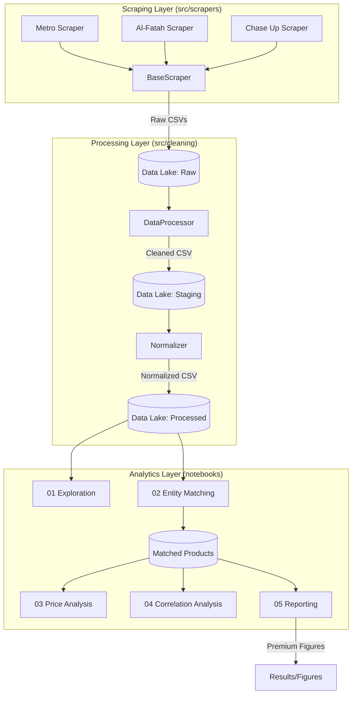

# Supermarket Price Index Pipeline (Ultimate Edition) 🛒📊


A production-grade, modular data engineering and analytics pipeline for monitoring grocery price dynamics across major Pakistani supermarket chains.

## 🏗️ System Architecture



## 🚀 Key Features
- **Scraping Layer**: Distributed collection from Metro, Al-Fatah, and Chase Up across 16 cities.
- **Entity Resolution**: Bayesian-inspired fuzzy matching aligning 11,000+ records using `rapidfuzz`.
- **Advanced Metrics**: Store-level Leader Dominance Index (LDI), Weighted LDI, and Product Synchronization scores.
- **Premium Analytics**: Portfolio of ridge plots, boxenplots, and hierarchical clustering for market behavior.
- **Scale**: Processed 638,000+ cleaned data points.

## 📁 Project Structure
- `src/`: Root for all source code.
  - `scrapers/`: Modular scraper logic for 3 major chains.
  - `config/`: Centralized settings and brand mapping.
  - `cleaning/`: Data processing and normalization logic.
- `data/`: Multi-stage data lake (Raw → Staging → Processed → Matched).
- `notebooks/`: Professional analysis suite (01 to 05).
- `docs/`: Technical reports, project roadmap, and social media drafts.
- `results/`: High-resolution figures and reporting tables.
- `scripts/`: Essential data management utilities.

## 🛠️ Installation & Setup
1. **Clone the repository**
2. **Install dependencies**:
   ```bash
   pip install -r requirements.txt
   ```
3. **Verify Environment**:
   ```bash
   python verify_constraints.py
   ```

## 📊 Quick Run Guide
- **Data Collection**: `PYTHONPATH=. python src/main.py`
- **Data Normalization**: `PYTHONPATH=. python src/cleaning/normalizer.py`
- **Interactive Dashboard**: `streamlit run src/visualization/app.py`
- **Entity Matching**: Open `notebooks/02_entity_matching.ipynb`
- **Full Report**: Open `notebooks/05_reporting.ipynb`

## 🎨 Visualization Gallery
Our pipeline produces assignment-grade, high-resolution insights:

| Market Synchronization | Price Volatility |
| :---: | :---: |
|  |  |
| *Hierarchical Clustering of Cities* | *Category-wise Price Volatility* |

| Price Density (Ridge Plot) | Match Diagnostics |
| :---: | :---: |
|  |  |
| *Price distribution per category* | *Fuzzy matching performance* |

## 📈 Quality Assurance (Layer 10)
This project has undergone rigorous QA, meeting the following targets:
- ✅ **638,623** rows in cleaned DataFrame.
- ✅ **11,561** matched product records.
- ✅ **16** cities covered across 3 chains.
- ✅ Fully re-runnable pipeline architecture.

---
*Created for the Data Science Assignment - Spring 2026*
